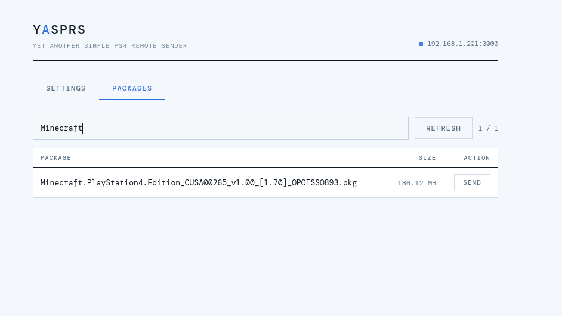

# YASPRS

**Yet Another Simple PS4 Package Remote Sender**



Send `.pkg` files to your PS4 over your local network via a web UI.

Built for simplicity: run it on any machine (including a headless server), then manage everything from a browser.

## Features

- **Web UI for headless setups** — run YASPRS as a service and control it from any browser on your LAN.
- **Recursive package discovery** — automatically finds `.pkg` files inside your configured folder, including subfolders.
- **One-click remote install** — sends selected packages directly to PS4 Remote Package Installer in one click.

## Requirements

- Node.js 16+
- PS4 running HEN / GoldHEN with **Remote Package Installer** open
- PS4 and this machine on the same local network

## Install

```bash
git clone https://github.com/duartebranco/yasprs.git
cd yasprs
npm install
```

## Setup

```bash
npm start
```

Then open **http://localhost:3001** in your browser.

1. Go to **Settings**
2. Set your **PS4 IP** and **PKG Base Path** (local folder containing `.pkg` files)
3. Save

Config is stored at:

- `$XDG_CONFIG_HOME/yasprs/profile.json`  
  or fallback: `~/.config/yasprs/profile.json`

## Usage

1. Go to **Packages**
2. Click **Refresh** to scan your PKG folder
3. Click **Send** on a package — YASPRS gives your PS4 a direct URL to install from

## Notes

This tool is intended for **local network use only**. There is no authentication on the web UI or API endpoints. If you run it on a shared or untrusted network, add your own access controls.

## Troubleshooting

- **No packages found**
  - Check that **PKG Base Path** is set correctly in Settings
  - Confirm the files end with `.pkg`

- **Send fails**
  - Confirm the **PS4 IP** is correct in Settings
  - Confirm **Remote Package Installer** is open on your PS4
  - Confirm both devices are on the same LAN

- **PS4 can't download the package**
  - Ensure the host machine's IP is reachable from the PS4
  - Check firewall rules for port `3001` on the host machine

## Contributing

Issues and pull requests are welcome:  
https://github.com/duartebranco/yasprs/issues
